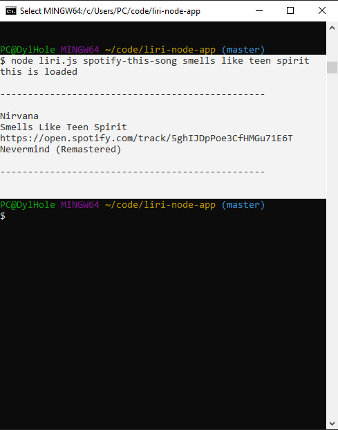
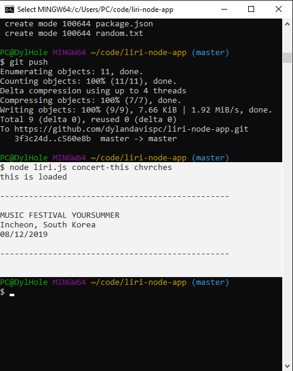
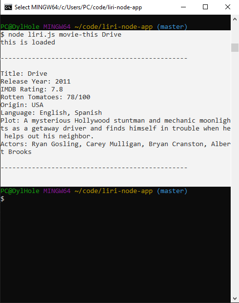
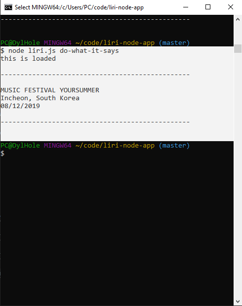

# liri-node-app

A node application that takes the Spotify, OMBD, &amp; Bands in Town API's via a faux "speech-to-text" or _LIRI_.

## Purpose

The liri-node-application, is a basic server-side program that demonstrates the capabilities of Node packages, API databases, and moderate JavaScript skills to accomplish the goal of retrieving & displaying data.

This example can relate to most media-compilation websites that utilize API's from databases such as Spotify, Bands in Town, etc.

## Instructions

To run this program, travel to the global file named _liri-node-app_ in the **terminal** and follow the directions below:

### Example (Manual Lookup):

`node liri.js spotify-this-song paper kitten nightmare`

1. type `node`

2. choose one of the following methods:
* `spotify-this-song` --- _search songs on spotify_
* `concert-this` --- _search for artist events_
* `movie-this` --- _look up movie details_
* `do-what-it-says` --- _faux speech (reads the random.txt file)_

3. enter the 'song', 'band', or 'movie' you want to look up!

__And Your Done!!!__

_or_

### Example (LIRI Lookup):

`node liri.js do-what-it-says`

1. type `node`

2. type `do-what-it-says`

This method retrieves any text in the _random.txt_ file.

To customize, edit the _random.txt_ according to the Manual Lookup directions.

__And Your Done!!!__

>**NOTICE:**
>To run this code on your own system, you will need to provide your own .env file with
>your own unique spotify API information.

## Links & Screen-Shots

* [GitHub Repository](https://github.com/dylandavispc/liri-node-app)

* Spotify-this Screenshot

* Concert-this Screenshot

* Movie-this Screenshot

* LIRI Screenshot

>go ahead. try to break my code looping the do-what-it-says...

